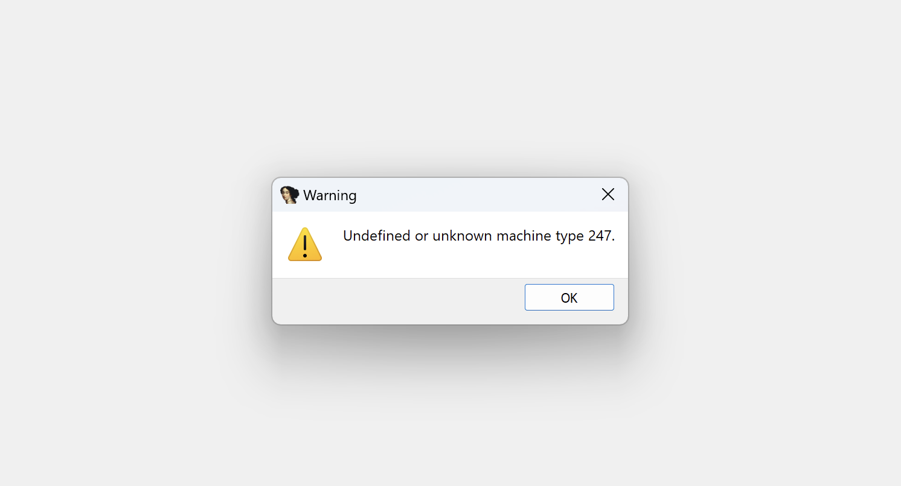
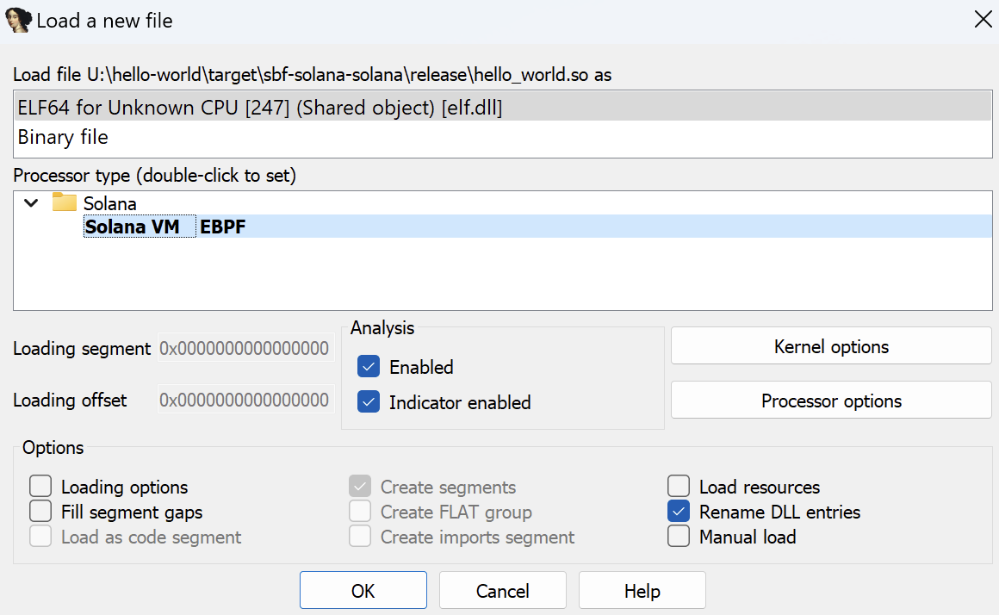
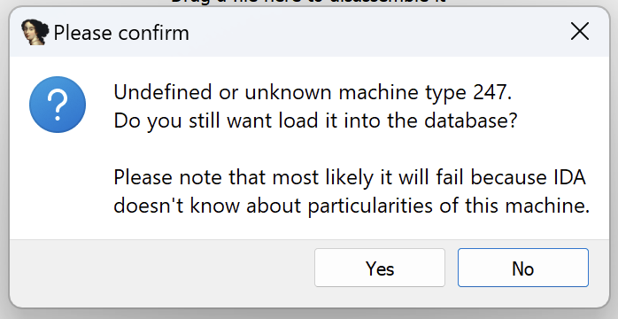

# IDA Pro Solana bytecode processor

This is the processor plugin for IDA Pro that adds the ability to analyze Solana Virtual Machine bytecode. Since SVM is based on the enhanced Berkeley Packet Filter (eBPF) and mostly uses the same instruction set, [this](https://github.com/zandi/eBPF_processor) eBPF processor plugin was used as a basis.

## How to use

Install `requirements.txt`. Copy `solana-init.py` script and the `solana` folder to the directory `<ida pro installation>/procs` and select the processor on a Solana program file loading to IDA.

To dump a program from Solana mainnet use the following command:

```
solana program dump <address of an account> <output file>
```

During the file import into IDA you may encounter the following error:



This is because the Solana EBPF processor should be selected explicitly. Double-click on the processor name in the processor list and select it:



Then select Yes:




## FLIRT signatures

Currently the last version of the signatures file is `flirt/solana.sig`. Place the file into `%IDA_DIR%/sig/solana` (create the solana folder) and load it via `File -> Load file -> FLIRT signature file...` menu.

### New signature file generation

The preprocessor `flirt/flair-preprocessor.py` generates a PAT file based on the given ELF eBPF library file extracted from `.rlib` file with functions.

To generate a new signature file you need to collect various `.rlib` files that you want to process, unpack them and generate the corresponding `.pat` file for each of `.o` libraries. After that, use the `sigmake` tool from official FLAIR suite to create a single `.sig` from all `.pat` files. So, just 2 commands:

```bash
python3 flait-preprocessor.py <input_file>.o <output_file>.pat
sigmake -nSolanaEBPF *.pat solana.sig
```

## What works now

* Solana eBPF instructions disassembling, including function calls and jumps
* Strings detection
* Relocations detection
* FLAIR preprocessor to generate PAT files with libs functions signatures

## TODO

* Parse and name Anchor functions and structures

## Thanks

Thanks to Clément Berthaux (clement (dot) berthaux (at) synacktiv (dot) com) and Michael Zandi (the (dot) zandi (at) gmail (dot) com) for developing the EBPF processor plugin, which is the base for this plugin.